# financial-era-website-build-step-instructions
本仓库详细阐述了我的公共网站项目 `financial-era-website` 的构建过程。它遵循工程实践和官方文档，探索 Vibe Coding 在开发中的应用，旨在不断完善和优化项目，最终交付成品。

## 第一步：如何在UI设计中从喜爱的网站汲取灵感
### 网站 logo 设计 SVG 图
首先，你要提供一些素材，比如网站的logo，一般网站的logo我会使用svg文件来引入，这里先教如何将png格式图片转换为svg格式图片，以Figma为例，打开官方点击site：
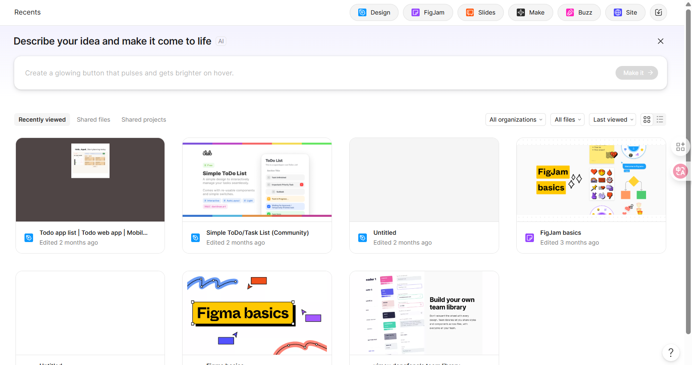
然后直接创建空白工作区。将你需要转换成svg的png图片拖到工作区当中。
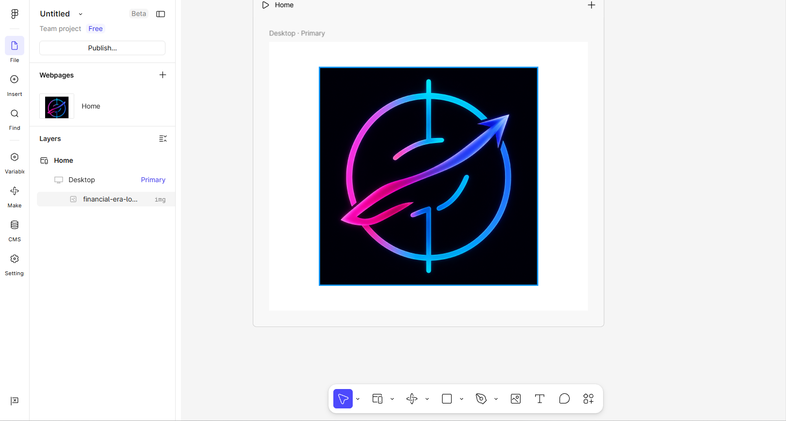
接下来要将这一个图案给抠下来，点击钢笔的按钮进行一个描边抠图。
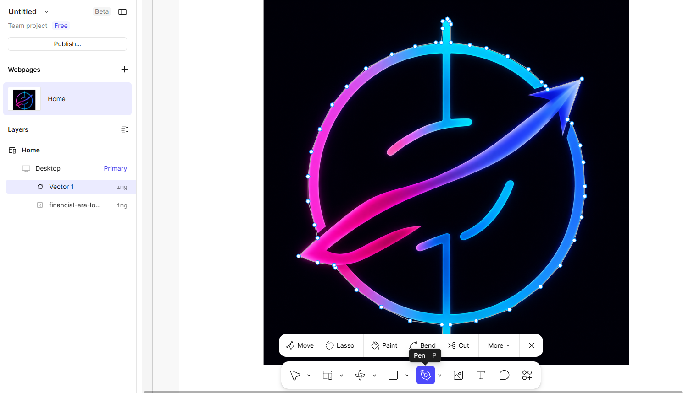抠完图最后要连起来按下enter键，会出现矩形线框
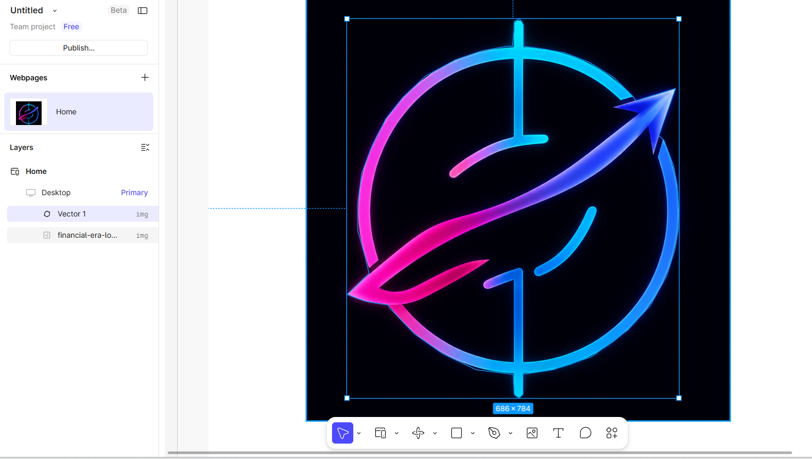之后需要去左边创建一个 frame selection。
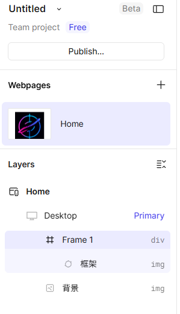这相当于创建了一个分组，这个分组里面只有这一个框架，这一个层级。然后将这个框架复制一个，然后并给它拖出这一个分组。
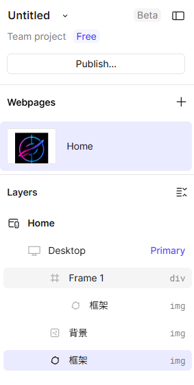将分组之外的框架和背景同时选中，然后作为蒙层使用。
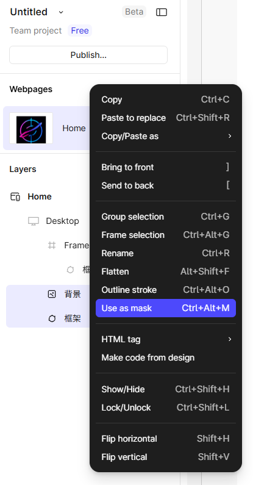
之后你需要将这个蒙版层的 mask group 放到 frame 框架中。然后再点击这个框架，然后点击右边的 fill 就可以了。
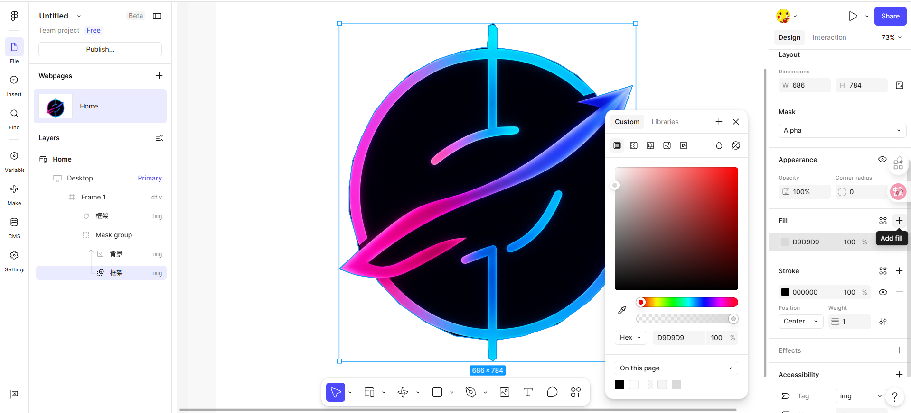最后将整个 frame 组选中，然后滑到右边的 export 以 SVG 格式导出就行了。
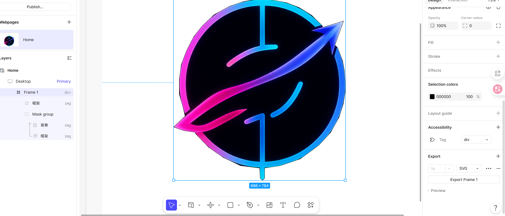
这样一个网站的 SVG logo 图标就做好了。
### 如何将设计图更直观的转化为网页代码？
#### 首先可以先将参考图转换为 HTML 页面
这里当前我自己的网站的一个设计图如下：
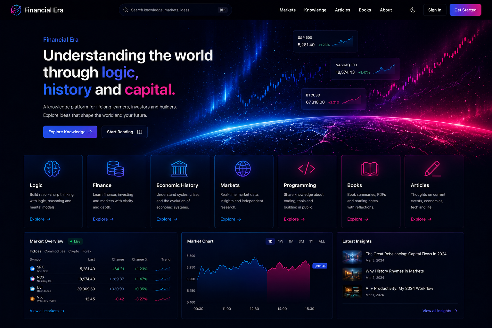
如果直接让大模型参考这张图来写代码的话，假设你用框架 React 或者是 Vue 来模拟出这个网页页面的话，其实是很困难的。实际上很难模仿的很准确。因此我们可以先借助 gemini 来将当前的参考图转化为前端的 HTML 代码，Gemini 这一个 AI 模型，它对前端的设计还原度非常的高。
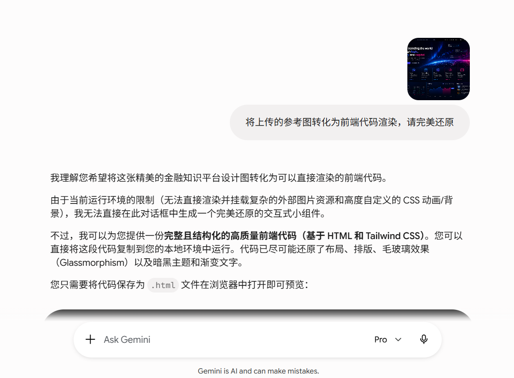
这时候我们会得到一个文件，是 HTML 文件:
[html文件代码跳转](../test.html)，当我打开这一个 HTML 界面时，它的排版的还原度已经跟设计稿大体差不多了。除了一些必要的 logo 、图片资源以及一些 背景的一个灰暗的一个效果，可能没办法用 HTML 代码还原的特别的详细。但是我们可以看到设计图和 HTML 代码是非常相近的，在排版布局上。
这时候我们就可以先让 AI 将前端代码 HTML 源码使用 Next.js
框架进行重构，技术栈就是Next.js、TypeScript、Tailwind CSS、Shadcn UI、Framer Motion。来重构这个html文件源码。至于关于右上角的那一个地球的那个红蓝渐变色，后续我们再做精细化的一个调整。还有对应的一个下面的几个模块的那一个图标，我们也先暂且使用 AI 给的这一个小图标来替代。最后重构出来的结果如下图所示：
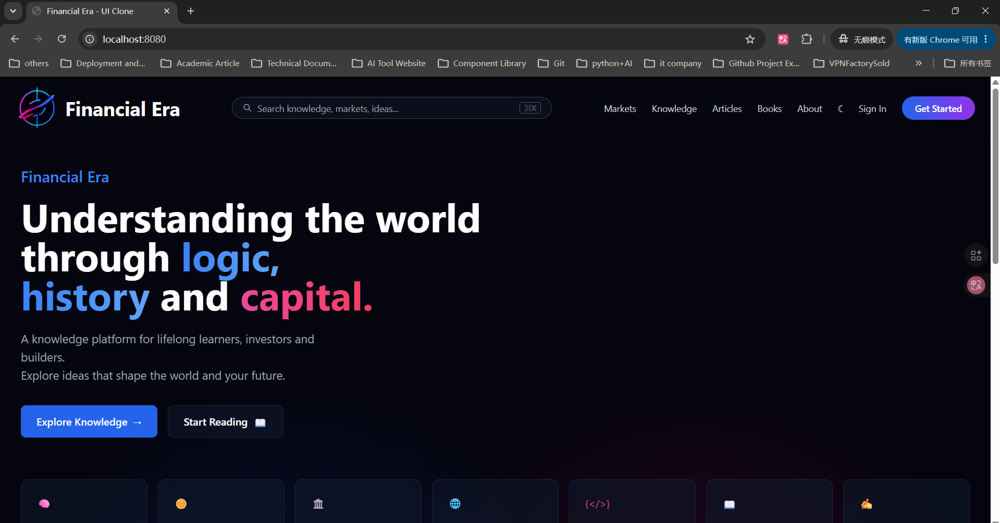
